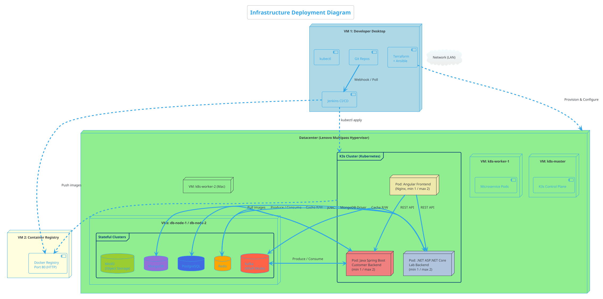
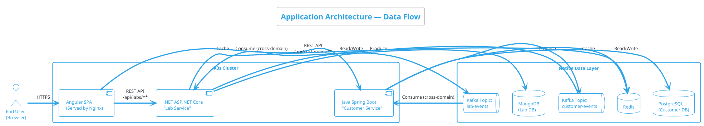

# 01 — Architecture Overview

> This document describes the high-level architecture of the DevOps Training Lab. It explains what each component is, why it exists, and how they all connect together.

---

## 1.1 The Big Picture

The lab simulates an enterprise microservices environment across **four machines**: three Ubuntu VMs on a MacBook (developer tools, container registry, and source control) and one physical Ubuntu server as the remote datacenter.

### System Context Diagram (PlantUML)

```plantuml
@startuml system_context
!theme cerulean-outline

title System Context Diagram — DevOps Training Lab

actor "DevOps Engineer" as dev

node "MacBook M5 Pro (UTM Host)" as mac {

    node "VM 1: Developer Desktop\n(Ubuntu)" as vm1 {
        component [IDE / Code Editor] as ide
        component [Jenkins CI/CD] as jenkins
        component [Terraform + Ansible] as iac
        component [kubectl] as kctl
    }

    node "VM 2: Container Registry\n(Ubuntu Server)" as vm2 {
        component [Docker Registry\nPrivate Docker Registry] as registry
    }

    node "VM 8: Source Control\n(Ubuntu Server)" as vm8 {
        component [Gitea\nGit Server] as gitea
    }
}

node "Lenovo Laptop — Datacenter\n(Multipass Hypervisor)" as dc {
    component [k8s-master VM\n(K3s Control Plane)] as k3smaster {
        component [Argo CD] as argocd
    }
    component [k8s-worker-1 VM\n(App Workloads)] as k3sworker
    component [k8s-worker-2 VM\n(Mac Workloads)] as k3sworker2
    component [db-node VMs\n(Kafka, Mongo, PG, Redis, MinIO)] as native
}

dev --> ide : Writes code
ide --> gitea : Commits Code & Manifests
gitea --> jenkins : Webhook Triggers CI
jenkins --> registry : Build & Push image
jenkins --> gitea : Update K8s Manifest Image Tag
argocd --> gitea : Watch for Manifest Changes
argocd --> k3sworker : Deploy Pods
argocd --> k3sworker2 : Deploy Pods
iac --> dc : Provision & configure
k3sworker --> registry : Pull images
@enduml
```

---

## 1.2 Four-Machine Topology

### Machine Overview

| # | Machine | Type | OS | RAM | Role |
|---|---------|------|----|-----|------|
| 1 | Developer Desktop | UTM VM | Ubuntu Desktop | 4 GB | Code, CI/CD, IaC, kubectl |
| 2 | Container Registry | UTM VM | Debian 12 Minimal | 1 GB | Docker Registry — private Docker images |
| 4 | Datacenter | Physical (Lenovo) | Multipass Hypervisor | 16 GB | Hosts 4 VMs (k8s-master, k8s-worker-1, 2x db-nodes) |
| 9 | Mac Worker | UTM/OrbStack VM | Ubuntu Server | 2 GB | `k8s-worker-2` — Expands Kubernetes cluster capacity |
| 8 | Source Control | UTM VM | Ubuntu Server | 1 GB | Gitea — Self-hosted Git repositories |

### Developer Desktop (VM 1)

All **human-driven** and **control-plane** activity happens here:

| Tool | Role |
|------|------|
| **Git CLI** | Local source control |
| **Jenkins** | CI/CD orchestrator — builds, tests, deploys |
| **Terraform** | Declares infrastructure on the Datacenter |
| **Ansible** | Installs software, configures remote hosts |
| **kubectl** | Manages K3s cluster remotely |

### Container Registry (VM 2)

| Component | Role |
|-----------|------|
| **Docker Registry** | Enterprise Docker registry with auth, RBAC, and vulnerability scanning |

> **Why Docker Registry?** Builds are confidential. Docker Registry provides authentication, role-based access control, audit logging, and optional image vulnerability scanning — all critical for enterprise security.

### Source Control (VM 8)

| Component | Role |
|-----------|------|
| **Gitea** | Lightweight, self-hosted Git service providing GitOps configuration hosting. |

> **Why the split between GitHub and Gitea?** To simulate a hybrid environment and adhere to GitOps best practices, we have separated concerns. The **Source Code** is hosted publicly on GitHub to allow easy cloning and remote IDE access. However, the **GitOps Manifests** (Kubernetes deployments) are hosted completely on-premises on our local Gitea instance. This ensures that our private cloud infrastructure state remains completely local, and Argo CD can sync from a local network repository without needing outbound internet access.

### Datacenter (Lenovo Laptop)

This is the **production-like deployment target** — it runs only workloads:

| Component | Role |
|-----------|------|
| **Multipass** | Native Ubuntu hypervisor that provisions lightweight VMs |
| **k8s-master VM** | Runs the K3s Kubernetes Control Plane |
| **k8s-worker-1 VM** | Runs the application microservices with HPA |
| **k8s-worker-2 VM** | Secondary worker node hosted on Mac to scale capacity |
| **db-node VMs** | Runs Kafka, Redis, PostgreSQL, MongoDB, and MinIO |

---

## 1.3 Full Infrastructure Diagram



---

## 1.4 Application Architecture

The lab simulates two business domains served by two independent backend microservices:



### How It Works

1. **End User** opens the Angular app in their browser.
2. **Angular Frontend** is served by Nginx inside K3s. It calls backends via REST through the Ingress.
3. **Customer Service (Java Spring Boot):** Owns customers. Uses PostgreSQL, Redis, publishes to Kafka.
4. **Lab Service (.NET ASP.NET Core):** Owns labs. Uses MongoDB, Redis, publishes to Kafka.
5. **Cross-Domain Sync:** Each service consumes the other's Kafka events for eventual consistency.

---

## 1.5 Why These Technology Choices?

| Technology | Why We Chose It | What You'll Learn |
|------------|-----------------|-------------------|
| **K3s** | Lightweight Kubernetes for constrained environments | kubectl, manifests, HPA |
| **Angular** | Enterprise frontend framework | Multi-stage Docker builds, Nginx |
| **Java Spring Boot** | Industry-standard enterprise backend | JVM tuning in containers, JDBC |
| **ASP.NET Core** | Cross-platform .NET for polyglot microservices | .NET CLI, multi-arch images |
| **Kafka (KRaft)** | Event streaming without ZooKeeper | Topics, producers, consumers |
| **Redis** | Sub-millisecond caching | Cache-aside pattern, TTL |
| **PostgreSQL** | Advanced relational database | SQL, migrations |
| **MongoDB** | Flexible document database | Document modeling |
| **Docker Registry** | Enterprise container registry | RBAC, vulnerability scanning |
| **Jenkins** | Most deployed CI/CD server | Jenkinsfile, pipelines |
| **Terraform** | Declarative infrastructure as code | HCL, state management |
| **Ansible** | Agentless configuration management | Playbooks, idempotency |

---

> **Next →** [Component Deep Dive](./component-deep-dive.md)
