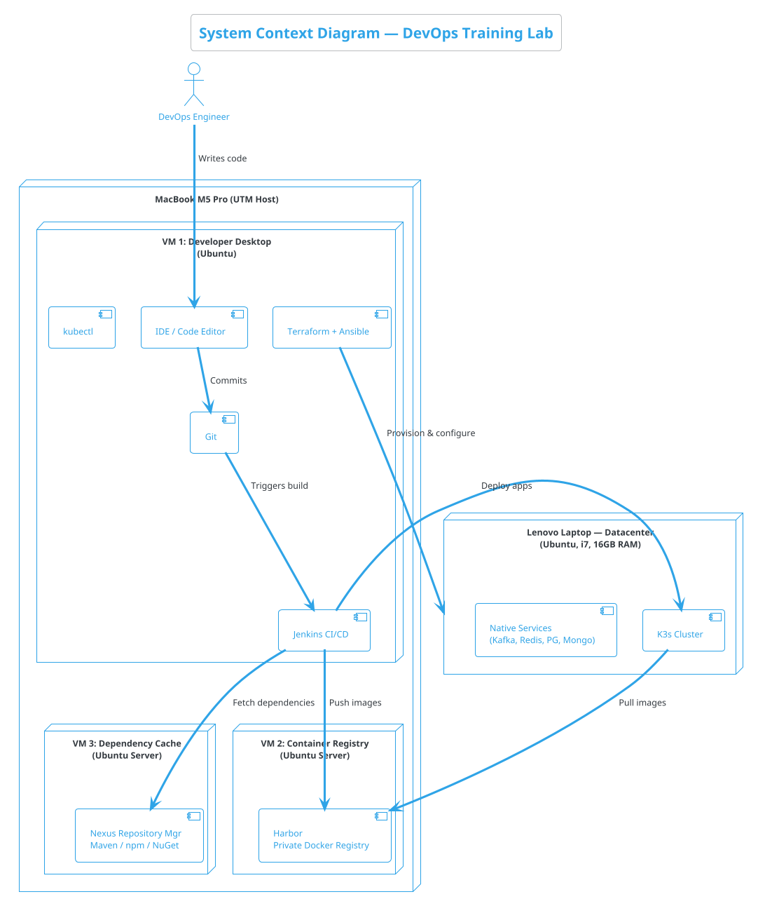
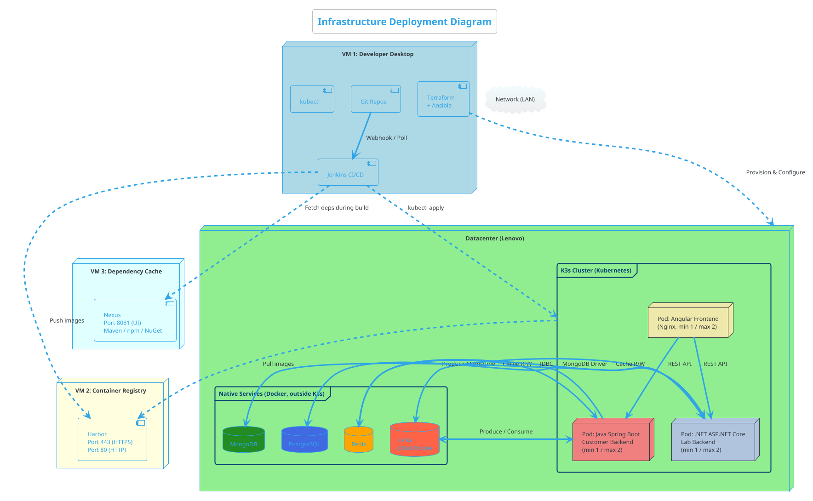
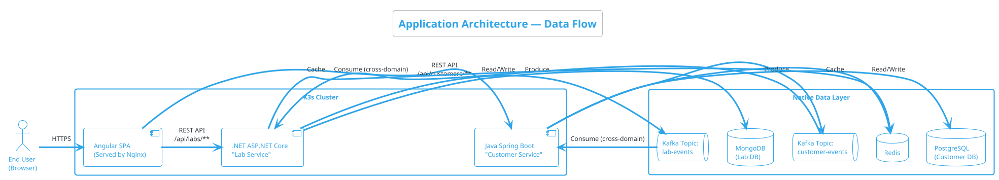

# 01 — Architecture Overview

> This document describes the high-level architecture of the DevOps Training Lab. It explains what each component is, why it exists, and how they all connect together.

---

## 1.1 The Big Picture

The lab simulates an enterprise microservices environment across **four machines**: three Ubuntu VMs on a MacBook (developer tools, container registry, dependency cache) and one physical Ubuntu server as the remote datacenter.

### System Context Diagram (PlantUML)

---

## 1.2 Four-Machine Topology

### Machine Overview

| # | Machine | Type | OS | RAM | Role |
|---|---------|------|----|-----|------|
| 1 | Developer Desktop | UTM VM | Ubuntu Desktop | 4 GB | Code, CI/CD, IaC, kubectl |
| 2 | Container Registry | UTM VM | Debian 12 Minimal | 1 GB | Harbor — private Docker images |
| 3 | Dependency Cache | UTM VM | Debian 12 Minimal | 1.5 GB | Nexus — Maven, npm, NuGet cache |
| 4 | Datacenter | Physical (Lenovo) | Ubuntu Desktop | 16 GB | K3s, Kafka, Redis, PG, Mongo |

### Developer Desktop (VM 1)

All **human-driven** and **control-plane** activity happens here:

| Tool | Role |
|------|------|
| **Git** | Source control — pushes trigger CI/CD |
| **Jenkins** | CI/CD orchestrator — builds, tests, deploys |
| **Terraform** | Declares infrastructure on the Datacenter |
| **Ansible** | Installs software, configures remote hosts |
| **kubectl** | Manages K3s cluster remotely |

### Container Registry (VM 2)

| Component | Role |
|-----------|------|
| **Harbor** | Enterprise Docker registry with auth, RBAC, and vulnerability scanning |

> **Why Harbor?** Builds are confidential. Harbor provides authentication, role-based access control, audit logging, and optional image vulnerability scanning — all critical for enterprise security.

### Dependency Cache (VM 3)

| Component | Role |
|-----------|------|
| **Nexus Repository Manager** | Proxies and caches Maven Central, npmjs.org, and NuGet.org |

> **Why separate from the registry?** In enterprise environments, artifact caches and container registries often run on different infrastructure for isolation and scaling. Separating them also teaches students about dependency management as a distinct concern.

### Datacenter (Lenovo Laptop)

This is the **production-like deployment target** — it runs only workloads:

| Component | Role |
|-----------|------|
| **K3s** | Lightweight Kubernetes — runs all apps in pods |
| **Kafka** | Async messaging between backends (Docker, outside K3s) |
| **Redis** | Shared cache (Docker, outside K3s) |
| **PostgreSQL** | Relational DB for Customer Service (Docker, outside K3s) |
| **MongoDB** | Document DB for Lab Service (Docker, outside K3s) |

---

## 1.3 Full Infrastructure Diagram

---

## 1.4 Application Architecture

The lab simulates two business domains served by two independent backend microservices:

### How It Works

1. **End User** opens the Angular app in their browser.
2. **Angular Frontend** is served by Nginx inside K3s. It calls backends via REST through the Ingress.
3. **Customer Service (Java Spring Boot):** Owns customers. Uses PostgreSQL, Redis, publishes to Kafka.
4. **Lab Service (.NET ASP.NET Core):** Owns labs. Uses MongoDB, Redis, publishes to Kafka.
5. **Cross-Domain Sync:** Each service consumes the other's Kafka events for eventual consistency.

---

## 1.5 Why These Technology Choices?

| Technology | Why We Chose It | What You'll Learn |
|------------|-----------------|-------------------|
| **K3s** | Lightweight Kubernetes for constrained environments | kubectl, manifests, HPA |
| **Angular** | Enterprise frontend framework | Multi-stage Docker builds, Nginx |
| **Java Spring Boot** | Industry-standard enterprise backend | JVM tuning in containers, JDBC |
| **ASP.NET Core** | Cross-platform .NET for polyglot microservices | .NET CLI, multi-arch images |
| **Kafka (KRaft)** | Event streaming without ZooKeeper | Topics, producers, consumers |
| **Redis** | Sub-millisecond caching | Cache-aside pattern, TTL |
| **PostgreSQL** | Advanced relational database | SQL, migrations |
| **MongoDB** | Flexible document database | Document modeling |
| **Harbor** | Enterprise container registry | RBAC, vulnerability scanning |
| **Nexus** | Universal dependency cache | Proxy repos, artifact management |
| **Jenkins** | Most deployed CI/CD server | Jenkinsfile, pipelines |
| **Terraform** | Declarative infrastructure as code | HCL, state management |
| **Ansible** | Agentless configuration management | Playbooks, idempotency |

---

> **Next →** [Component Deep Dive](./component-deep-dive.md)
