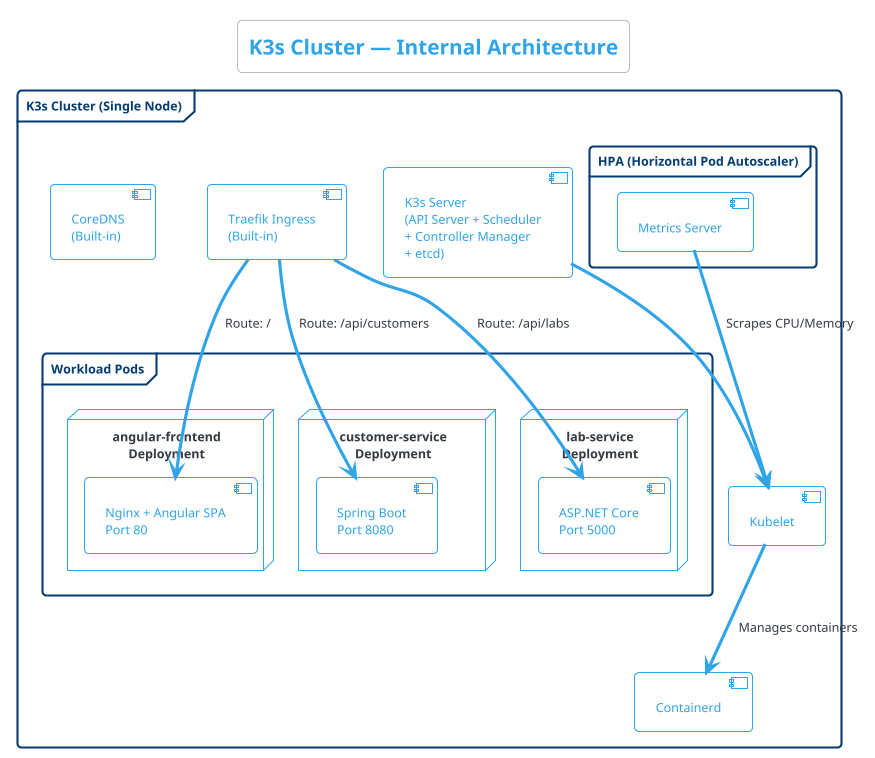
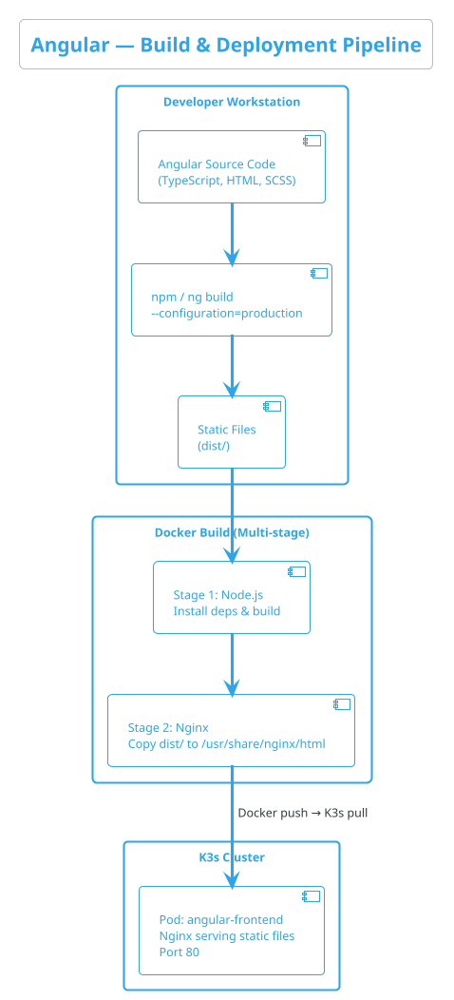
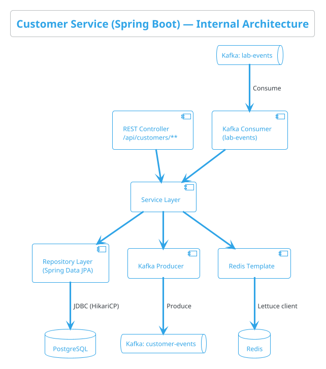
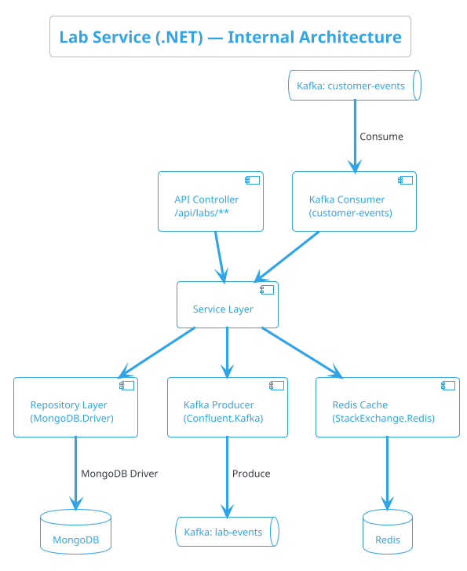
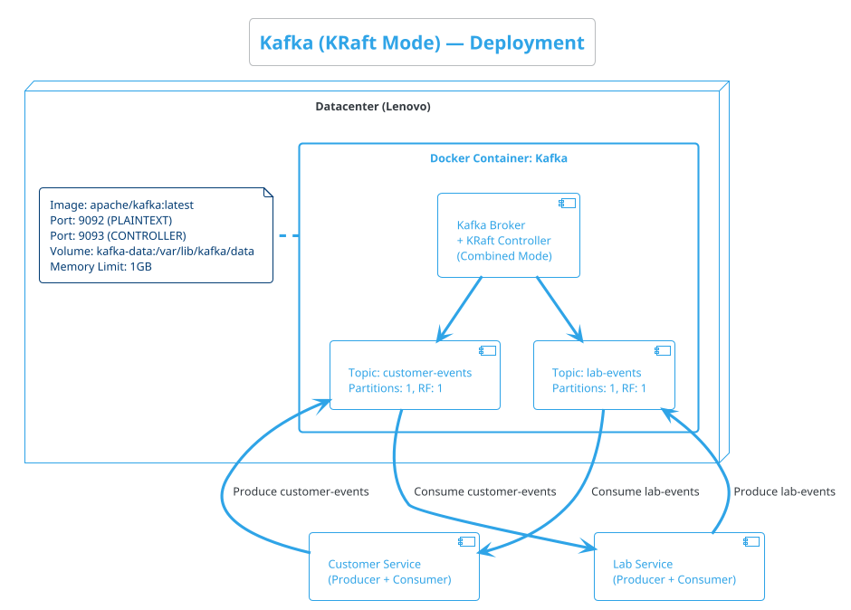
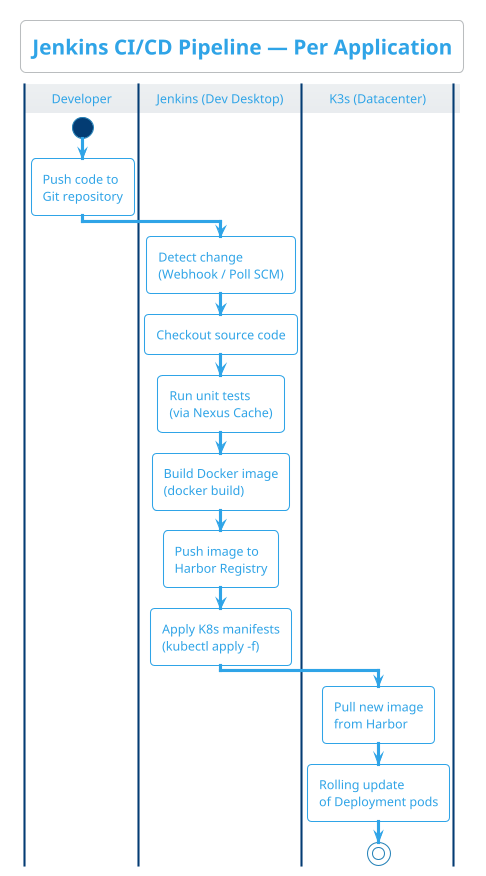
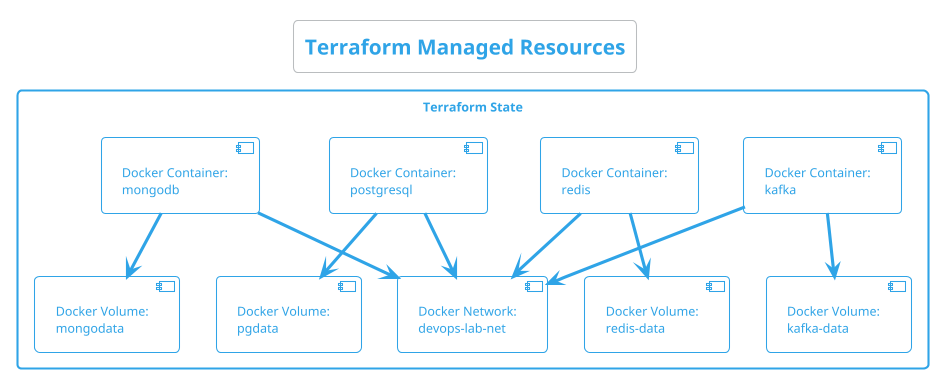

# 02 — Component Deep Dive

> This document provides a detailed breakdown of every component in the DevOps Training Lab. For each component, you'll learn **what it is**, **why it's here**, **how it's deployed**, and **key configuration considerations**.

---

## Table of Contents

1. [K3s — Kubernetes Cluster](#21-k3s--kubernetes-cluster)
2. [Angular Frontend](#22-angular-frontend)
3. [Java Spring Boot — Customer Service](#23-java-spring-boot--customer-service)
4. [.NET ASP.NET Core — Lab Service](#24-net-aspnet-core--lab-service)
5. [Apache Kafka (KRaft Mode)](#25-apache-kafka-kraft-mode)
6. [Redis](#26-redis)
7. [PostgreSQL](#27-postgresql)
8. [MongoDB](#28-mongodb)
9. [Jenkins](#29-jenkins)
10. [Terraform](#210-terraform)
11. [Ansible](#211-ansible)
12. [Harbor — Container Registry](#212-harbor--container-registry)
13. [Nexus — Dependency Cache](#213-nexus--dependency-cache)

---

## 2.1 K3s — Kubernetes Cluster

### What Is It?

**K3s** is a certified, lightweight Kubernetes distribution built by Rancher (now SUSE). It packages the entire Kubernetes control plane into a single binary under 100MB. It is fully conformant with upstream Kubernetes — anything that works on K8s works on K3s.

### Component Diagram (PlantUML)



### Why K3s Over Full Kubernetes?

| Feature | Full K8s (kubeadm) | K3s |
|---------|-------------------|-----|
| RAM usage (idle) | ~2-4 GB | ~512 MB |
| Binary size | Hundreds of MBs | ~70 MB |
| etcd | External cluster required | Embedded SQLite/etcd |
| Install time | 30+ minutes | < 30 seconds |
| K8s conformance | ✅ | ✅ |
| Ingress controller | Separate install | Traefik built-in |

### Key Configuration Points

- **Single-node mode:** Both server and agent run on the same Datacenter host (Lenovo laptop).
- **Traefik Ingress:** Pre-installed. Routes external traffic to pods based on path rules.
- **Containerd:** The container runtime. K3s does NOT use Docker for running pods.
- **`kubeconfig`:** Located at `/etc/rancher/k3s/k3s.yaml`. Copy this to your Developer Desktop VM for remote `kubectl` access.

### Resource Limits

All deployments will have explicit resource limits to prevent any single pod from starving the system:

```yaml
# Example: resource limits in a Deployment manifest
resources:
  requests:
    memory: "128Mi"
    cpu: "100m"
  limits:
    memory: "512Mi"
    cpu: "500m"
```

---

## 2.2 Angular Frontend

### What Is It?

**Angular** is a TypeScript-based frontend framework by Google for building Single-Page Applications (SPAs). In this lab, the Angular app is compiled into static files and served by an **Nginx** web server inside a Kubernetes pod.

### How It's Deployed



### Key Concepts for Trainees

- **Multi-stage Docker build:** The Docker image is built in two stages. Stage 1 uses Node.js to compile TypeScript → JavaScript. Stage 2 copies only the compiled output into a tiny Nginx image. This keeps the final image small (~30MB).
- **Nginx config:** A custom `nginx.conf` handles SPA routing (all paths return `index.html`), API proxying, and gzip compression.
- **Environment config:** API base URLs are injected at build time or via `environment.ts`.

### Resource Budget

| Setting | Value |
|---------|-------|
| Memory Request | 64Mi |
| Memory Limit | 256Mi |
| CPU Request | 50m |
| CPU Limit | 250m |
| Min Replicas (HPA) | 1 |
| Max Replicas (HPA) | 2 |

---

## 2.3 Java Spring Boot — Customer Service

### What Is It?

**Spring Boot** is a Java-based framework for building production-ready microservices. The Customer Service owns the `customers` business domain — managing customer records, profiles, and related workflows.

### Responsibilities

- CRUD operations for customer entities
- Reads/writes to **PostgreSQL**
- Caches hot data in **Redis**
- Publishes `customer-events` to **Kafka** (e.g., `CustomerCreated`, `CustomerUpdated`)
- Consumes `lab-events` from Kafka for cross-domain sync

### Architecture (PlantUML)



### Key Configuration Points

- **JVM Memory:** Explicitly set `-Xmx384m` in the Dockerfile's `ENTRYPOINT` to prevent the JVM from consuming all available container memory.
- **HikariCP:** Connection pool for PostgreSQL. Set `maximumPoolSize=5` for the constrained environment.
- **Spring Kafka:** Use `spring.kafka.bootstrap-servers` pointing to the Kafka Docker container's host IP and port.
- **Spring Data Redis:** Use `spring.redis.host` pointing to the Redis container.

### Resource Budget

| Setting | Value |
|---------|-------|
| Memory Request | 256Mi |
| Memory Limit | 512Mi |
| CPU Request | 100m |
| CPU Limit | 500m |
| Min Replicas (HPA) | 1 |
| Max Replicas (HPA) | 2 |

---

## 2.4 .NET ASP.NET Core — Lab Service

### What Is It?

**ASP.NET Core** is a cross-platform, high-performance .NET framework for building web APIs. The Lab Service owns the `labs` business domain — managing lab records, test results, and related data.

### Responsibilities

- CRUD operations for lab entities
- Reads/writes to **MongoDB**
- Caches hot data in **Redis**
- Publishes `lab-events` to **Kafka**
- Consumes `customer-events` from Kafka for cross-domain sync

### Architecture (PlantUML)



### Key Configuration Points

- **.NET Memory:** Set `DOTNET_GCHeapHardLimit` environment variable in the Dockerfile to cap managed heap.
- **MongoDB.Driver:** Configure connection string pointing to the Mongo container.
- **Confluent.Kafka NuGet:** The standard .NET Kafka client library.
- **StackExchange.Redis:** The most popular .NET Redis client.

### Resource Budget

| Setting | Value |
|---------|-------|
| Memory Request | 128Mi |
| Memory Limit | 512Mi |
| CPU Request | 100m |
| CPU Limit | 500m |
| Min Replicas (HPA) | 1 |
| Max Replicas (HPA) | 2 |

---

## 2.5 Apache Kafka (KRaft Mode)

### What Is It?

**Apache Kafka** is a distributed event-streaming platform capable of handling millions of events per second. It allows services to communicate asynchronously by publishing and subscribing to **topics**.

### Why KRaft Mode?

Traditionally, Kafka required **Apache ZooKeeper** for cluster coordination (leader election, metadata). **KRaft mode** (Kafka Raft) eliminates this dependency entirely — Kafka manages its own metadata consensus. This saves significant RAM and reduces operational complexity.

### Deployment (PlantUML)



### Key Configuration Points

- **Single broker, combined mode:** In KRaft mode, the broker and controller run in the same process. Perfect for a dev/lab environment.
- **Partitions = 1:** Single partition per topic is sufficient for this lab. In production, you'd use multiple partitions for parallelism.
- **Replication factor = 1:** We have only one broker. In production, RF ≥ 3.
- **Memory:** Kafka's JVM heap is set to 512MB. Combined with OS page cache, the container is capped at 1GB.
- **Data persistence:** A Docker volume (`kafka-data`) ensures topic data survives container restarts.

---

## 2.6 Redis

### What Is It?

**Redis** is an in-memory data structure store used as a cache, session store, and message broker. It is **extremely fast** — capable of hundreds of thousands of operations per second with sub-millisecond latency.

### Role in This Architecture

- **Shared cache** between the Java and .NET services. Both services can cache frequently read data to reduce database load.
- **Session store** for user session data (optional exercise).
- **Not used as a message broker** in this lab — Kafka handles async messaging.

### Key Configuration Points

| Setting | Value |
|---------|-------|
| Docker Image | `redis:7-alpine` |
| Port | 6379 |
| Max Memory | 256MB |
| Eviction Policy | `allkeys-lru` (Least Recently Used) |
| Persistence | RDB snapshots (for lab purposes) |

---

## 2.7 PostgreSQL

### What Is It?

**PostgreSQL** (often called "Postgres") is the world's most advanced open-source relational database. It supports complex queries, ACID transactions, JSON data, and full-text search.

### Role in This Architecture

- **Exclusive data store for the Customer Service (Java Spring Boot).**
- Stores structured customer data: profiles, addresses, contact information, etc.
- Schema managed via **Flyway** or **Liquibase** migrations (run by Spring Boot on startup).

### Key Configuration Points

| Setting | Value |
|---------|-------|
| Docker Image | `postgres:16-alpine` |
| Port | 5432 |
| Shared Buffers | 128MB |
| Max Connections | 20 |
| Data Volume | `pgdata:/var/lib/postgresql/data` |
| Default Database | `customerdb` |

---

## 2.8 MongoDB

### What Is It?

**MongoDB** is a document-oriented NoSQL database that stores data in flexible, JSON-like documents (BSON). It is ideal for data with varying structure or rapidly evolving schemas.

### Role in This Architecture

- **Exclusive data store for the Lab Service (.NET ASP.NET Core).**
- Stores semi-structured lab data: test results, reports, configurations, etc.
- The flexible schema allows lab records to have different fields without requiring migrations.

### Key Configuration Points

| Setting | Value |
|---------|-------|
| Docker Image | `mongo:7` |
| Port | 27017 |
| WiredTiger Cache Size | 256MB |
| Data Volume | `mongodata:/data/db` |
| Default Database | `labdb` |

---

## 2.9 Jenkins

### What Is It?

**Jenkins** is the most widely deployed open-source CI/CD automation server. It executes **pipelines** defined in `Jenkinsfile`s that build, test, and deploy applications automatically.

### Role in This Architecture

- Runs on the **Developer Desktop VM (Ubuntu)**.
- Watches Git repositories for changes.
- Builds Docker images for all three applications (using dependencies cached in Nexus).
- Pushes images to the **Harbor Container Registry**.
- Deploys updated manifests to the K3s cluster on the Datacenter via remote `kubectl`.

### Pipeline Overview (PlantUML)



---

## 2.10 Terraform

### What Is It?

**Terraform** is HashiCorp's Infrastructure-as-Code (IaC) tool. You write declarative configuration files (HCL) that describe the desired state of your infrastructure, and Terraform makes it so.

### Role in This Architecture

- Runs on the **Developer Desktop VM**.
- Provisions Docker containers on the remote Datacenter (using the Docker provider over SSH/TCP).
- Manages the lifecycle of Kafka, Redis, PostgreSQL, and MongoDB containers.
- Manages Docker volumes and networks.

### What Terraform Manages



---

## 2.11 Ansible

### What Is It?

**Ansible** is an agentless IT automation tool. It connects to remote hosts via SSH and runs **playbooks** (YAML files) to install software, manage configurations, and orchestrate multi-step processes.

### Role in This Architecture

- Runs on the **Developer Desktop VM**.
- Installs Docker and K3s on the Datacenter.
- Configures system settings (sysctl, firewall, etc.).
- Can be combined with Terraform or used independently for configuration management.

### Ansible vs. Terraform — When to Use Each

| Task | Use Terraform | Use Ansible |
|------|:---:|:---:|
| Provision a Docker container | ✅ | ❌ |
| Install Docker on Ubuntu | ❌ | ✅ |
| Install K3s | ❌ | ✅ |
| Configure sysctl / firewall | ❌ | ✅ |
| Manage container volumes/networks | ✅ | ❌ |
| Deploy K8s manifests | ❌ | ✅ (or kubectl) |
| Template configuration files | ❌ | ✅ |

> **Rule of Thumb:** Use **Terraform** for _provisioning_ (creating/destroying resources). Use **Ansible** for _configuration_ (installing software, editing files, managing state).

---

## 2.12 Harbor — Container Registry

### What Is It?

**Harbor** is an open-source, trusted cloud-native container registry that stores, signs, and scans content. It provides enterprise-level security, identity, and management features.

### Role in This Architecture

- Runs on a dedicated **Debian 12 Minimal VM** hosted in UTM on the MacBook.
- Acts as the central, private storage for all Docker images built by Jenkins.
- The K3s cluster on the Datacenter pulls application images exclusively from this registry.
- Ensures all application code and built artifacts remain completely internal and confidential.

---

## 2.13 Nexus — Dependency Cache

### What Is It?

**Sonatype Nexus Repository Manager (OSS)** is a repository manager that caches dependencies from public repositories (Maven Central, npmjs, NuGet Gallery) locally.

### Role in This Architecture

- Runs on a dedicated **Debian 12 Minimal VM** hosted in UTM on the MacBook.
- Serves as a transparent caching proxy for the Developer Desktop VM during Jenkins builds.
- Drastically speeds up build times by serving cached Java `.jar`s, Node `.tgz` modules, and .NET `.nupkg`s over the local network instead of the internet.
- Provides resilience in case upstream package registries experience downtime.

---

> **Next →** [Network & Communication](./network-and-communication.md)
