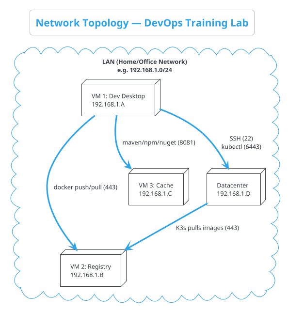

# Network & Communication

> This document explains how every component in the DevOps Training Lab discovers and communicates with every other component across all four machines.

---

## 3.1 Network Topology Overview



> **All four machines must be on the same LAN** (or reachable via routing). UTM VMs must use **Bridged** networking to get LAN IP addresses.

---

## 3.2 Network Summary — All Machines

| Machine | IP (example) | Networks Used |
|---------|-------------|---------------|
| VM 1: Dev Desktop | 192.168.1.A | LAN only |
| VM 2: Registry | 192.168.1.B | LAN only |
| VM 3: Cache | 192.168.1.C | LAN only |
| Datacenter | 192.168.1.D | LAN + Docker Bridge (`devops-lab-net`) + K3s Pod/Service networks |

### Datacenter Internal Networks

| Network | CIDR | Managed By | What Lives Here |
|---------|------|------------|-----------------|
| **Docker Bridge** (`devops-lab-net`) | `172.18.0.0/16` | Docker Engine | Kafka, Redis, PostgreSQL, MongoDB |
| **K3s Pod Network** | `10.42.0.0/16` | K3s (Flannel CNI) | Application pods |
| **K3s Service Network** | `10.43.0.0/16` | K3s | ClusterIP Services |

---

## 3.3 Port Map — Complete Reference

### VM 1: Developer Desktop

| Service | Port | Protocol |
|---------|------|----------|
| Jenkins Web UI | 8080 | HTTP |

### VM 2: Container Registry

| Service | Port | Protocol |
|---------|------|----------|
| Harbor Web UI / API | 443 | HTTPS |
| Harbor (HTTP fallback) | 80 | HTTP |

### VM 3: Dependency Cache

| Service | Port | Protocol |
|---------|------|----------|
| Nexus Web UI | 8081 | HTTP |
| Nexus Docker Proxy (optional) | 8083 | HTTP |

### Datacenter

| Service | Port | Published? | Protocol |
|---------|------|-----------|----------|
| K3s API Server | 6443 | Yes | HTTPS |
| Traefik Ingress | 80 / 443 | Yes | HTTP/HTTPS |
| Angular Frontend | 80 | via Ingress | HTTP |
| Customer Service | 8080 | via Ingress | HTTP |
| Lab Service | 5000 | via Ingress | HTTP |
| Kafka Broker | 9092 | Yes | Kafka TCP |
| Redis | 6379 | Yes | RESP |
| PostgreSQL | 5432 | Yes | PostgreSQL |
| MongoDB | 27017 | Yes | MongoDB Wire |

---

## 3.4 Communication Patterns

### Build & Deploy Flow

```
Developer Desktop (VM 1)
    │
    ├── Jenkins builds code
    │   ├── Fetches dependencies from Nexus (VM 3)
    │   ├── Runs tests
    │   └── Builds Docker image
    │
    ├── Jenkins pushes image to Harbor (VM 2)
    │
    └── Jenkins deploys to K3s (Datacenter)
            │
            └── K3s pulls image from Harbor (VM 2)
```

### Runtime (Synchronous)

| From | To | Protocol | Via |
|------|----|----------|-----|
| Browser | Angular (K3s) | HTTPS | Traefik Ingress on Datacenter |
| Angular | Customer Service | HTTP | K3s Ingress path routing |
| Angular | Lab Service | HTTP | K3s Ingress path routing |
| Customer Service | PostgreSQL | TCP | Datacenter host IP:5432 |
| Lab Service | MongoDB | TCP | Datacenter host IP:27017 |
| Both Services | Redis | TCP | Datacenter host IP:6379 |

### Runtime (Asynchronous — Kafka)

| From | To | Topic | Purpose |
|------|----|-------|---------|
| Customer Service | Kafka | `customer-events` | Publish domain events |
| Lab Service | Kafka | `lab-events` | Publish domain events |
| Customer Service | Kafka | `lab-events` | Consume cross-domain events |
| Lab Service | Kafka | `customer-events` | Consume cross-domain events |

---

## 3.5 How K3s Pods Reach Native Services

K3s pods connect to Docker containers (Kafka, Redis, PG, Mongo) using the **Datacenter's LAN IP address** and published ports:

```yaml
# Example: Spring Boot application.yml
spring:
  datasource:
    url: jdbc:postgresql://192.168.1.D:5432/customerdb
  kafka:
    bootstrap-servers: 192.168.1.D:9092
  redis:
    host: 192.168.1.D
    port: 6379
```

---

## 3.6 Firewall Rules

### Datacenter

```bash
sudo ufw allow 22/tcp      # SSH
sudo ufw allow 80/tcp      # Traefik HTTP
sudo ufw allow 443/tcp     # Traefik HTTPS
sudo ufw allow 5432/tcp    # PostgreSQL
sudo ufw allow 6379/tcp    # Redis
sudo ufw allow 6443/tcp    # K3s API
sudo ufw allow 9092/tcp    # Kafka
sudo ufw allow 27017/tcp   # MongoDB
```

### Container Registry (VM 2)

```bash
sudo ufw allow 80/tcp      # Harbor HTTP
sudo ufw allow 443/tcp     # Harbor HTTPS
```

### Dependency Cache (VM 3)

```bash
sudo ufw allow 8081/tcp    # Nexus UI
```

---

> **Next →** [Resource Planning](./resource-planning.md)
