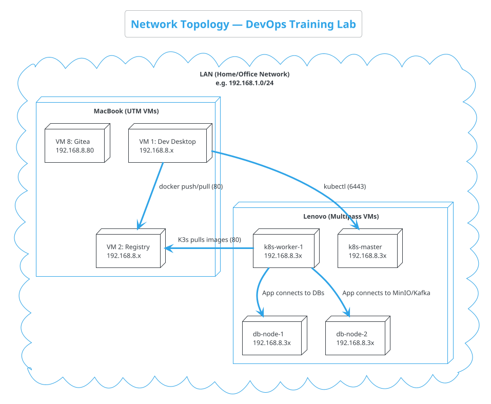

# Network & Communication

> This document explains how every component in the DevOps Training Lab discovers and communicates with every other component across the hypervisor environment.

---

## 3.1 Network Topology Overview



> **All machines and VMs must be on the same LAN**. UTM and Multipass VMs must use **Bridged** networking to get physical LAN IP addresses. The Multipass VMs on the Lenovo are configured to use the `192.168.8.30-39` range.

---

## 3.2 Network Summary — All Machines

| Machine | Role | Networks Used |
|---------|------|---------------|
| VM 1: Dev Desktop | Control Plane | LAN only |
| VM 2: Registry | Image Storage | LAN only |
| VM 8: Source Control | Gitea | LAN only |
| `k8s-master` | K3s Control Plane | LAN + K3s Pod/Service networks |
| `k8s-worker-1` | App Workloads | LAN + K3s Pod/Service networks |
| `db-node-1` | Stateful DBs | LAN + Docker Bridge |
| `db-node-2` | Stateful DBs | LAN + Docker Bridge |

### Kubernetes Internal Networks

| Network | CIDR | Managed By | What Lives Here |
|---------|------|------------|-----------------|
| **K3s Pod Network** | `10.42.0.0/16` | K3s (Flannel CNI) | Application pods |
| **K3s Service Network** | `10.43.0.0/16` | K3s | ClusterIP Services |

---

## 3.3 Port Map — Complete Reference

### MacBook VMs

| Service | Port | Protocol | Hosted On |
|---------|------|----------|-----------|
| Jenkins Web UI | 8080 | HTTP | VM 1: Dev Desktop |
| Docker Registry | 80 | HTTP | VM 2: Registry |
| Gitea Web UI | 3000 | HTTP | VM 8: Source Control |

### Lenovo Multipass VMs

| Service | Port | Published? | Protocol | Hosted On |
|---------|------|-----------|----------|-----------|
| K3s API Server | 6443 | Yes | HTTPS | `k8s-master` |
| Traefik Ingress | 80 / 443 | Yes | HTTP/HTTPS | `k8s-worker-1` |
| Angular Frontend | 80 | via Ingress | HTTP | `k8s-worker-1` |
| Customer Service | 8080 | via Ingress | HTTP | `k8s-worker-1` |
| Lab Service | 5000 | via Ingress | HTTP | `k8s-worker-1` |
| PostgreSQL | 5432 | Yes | PostgreSQL | `db-node-1` |
| MongoDB | 27017 | Yes | MongoDB Wire | `db-node-1` |
| Redis | 6379 | Yes | RESP | `db-node-1` |
| Kafka Broker | 9092 | Yes | Kafka TCP | `db-node-2` |
| MinIO API | 9000 | Yes | HTTP (S3) | `db-node-2` |
| MinIO Console | 9001 | Yes | HTTP | `db-node-2` |

---

## 3.4 Communication Patterns

### Build & Deploy Flow

```
Developer Desktop (VM 1)
    │
    ├── IDE checks code into Gitea (VM 8)
    │
    ├── Jenkins is triggered via Webhook from Gitea
    │   ├── Checks out code
    │   ├── Runs tests
    │   └── Builds Docker image
    │
    ├── Jenkins pushes image to Registry (VM 2)
    │
    └── Jenkins pushes updated Kubernetes manifests back to Gitea
    
Datacenter (K3s)
    │
    └── Argo CD detects manifest changes in Gitea and deploys new Pods
```

### Application Traffic Flow

```
User Browser
    │
    ▼ (HTTP Port 80)
`k8s-worker-1` (Traefik Ingress)
    │
    ├── Route `/` ─────────► Angular Frontend Pod
    ├── Route `/api/customers` ─► Customer Service Pod
    └── Route `/api/labs` ──────► Lab Service Pod
```

### Backend to Database Flow

```
`k8s-worker-1` (Application Pods)
    │
    ├── Customer Service Pod
    │   ├── TCP 5432 ──► `db-node-1` (PostgreSQL)
    │   └── TCP 9092 ──► `db-node-2` (Kafka)
    │
    └── Lab Service Pod
        ├── TCP 27017 ─► `db-node-1` (MongoDB)
        └── TCP 9000 ──► `db-node-2` (MinIO API)
```

---

## 3.5 Firewall Rules (UFW)

Because the Datacenter runs Multipass, the firewall rules need to be applied on the individual VMs rather than the bare-metal host.

### For Kubernetes Nodes (`k8s-master`, `k8s-worker-1`)
```bash
sudo ufw allow 6443/tcp  # K3s API
sudo ufw allow 80/tcp    # HTTP Ingress
sudo ufw allow 443/tcp   # HTTPS Ingress
```

### For Database Nodes (`db-node-1`, `db-node-2`)
```bash
# db-node-1
sudo ufw allow 5432/tcp  # Postgres
sudo ufw allow 27017/tcp # Mongo
sudo ufw allow 6379/tcp  # Redis

# db-node-2
sudo ufw allow 9092/tcp  # Kafka
sudo ufw allow 9000/tcp  # MinIO API
sudo ufw allow 9001/tcp  # MinIO Console
```

---

> **Ready to build?** Start with [`infra/00-developer-workstation/`](../infra/00-developer-workstation/)
